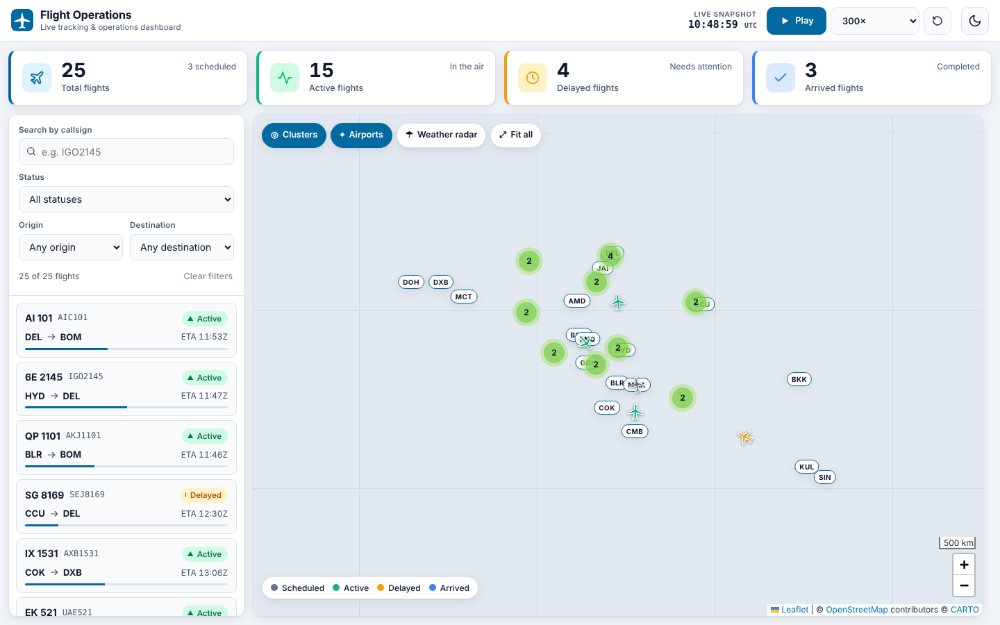
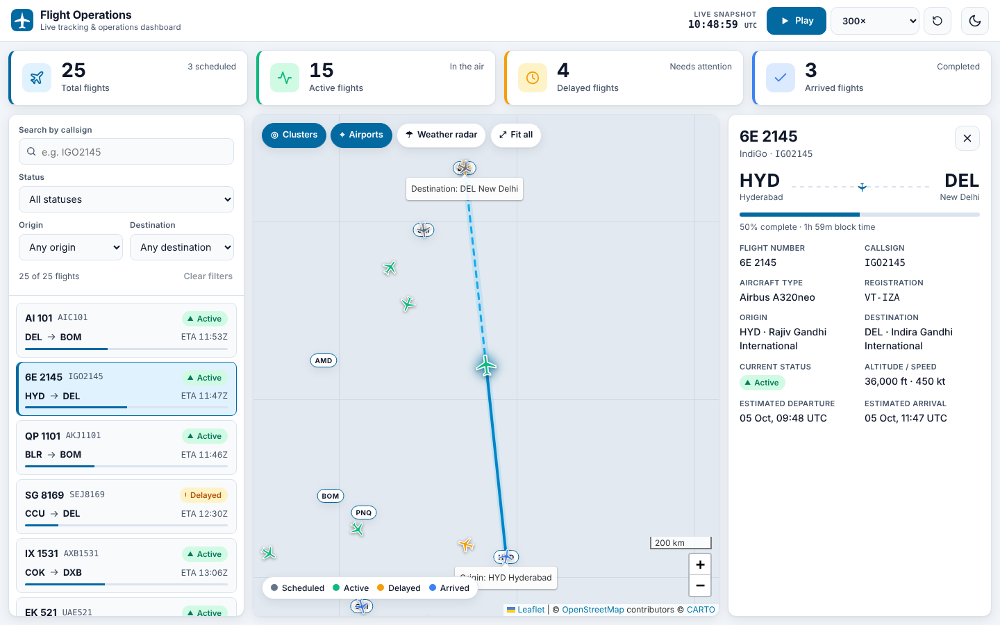
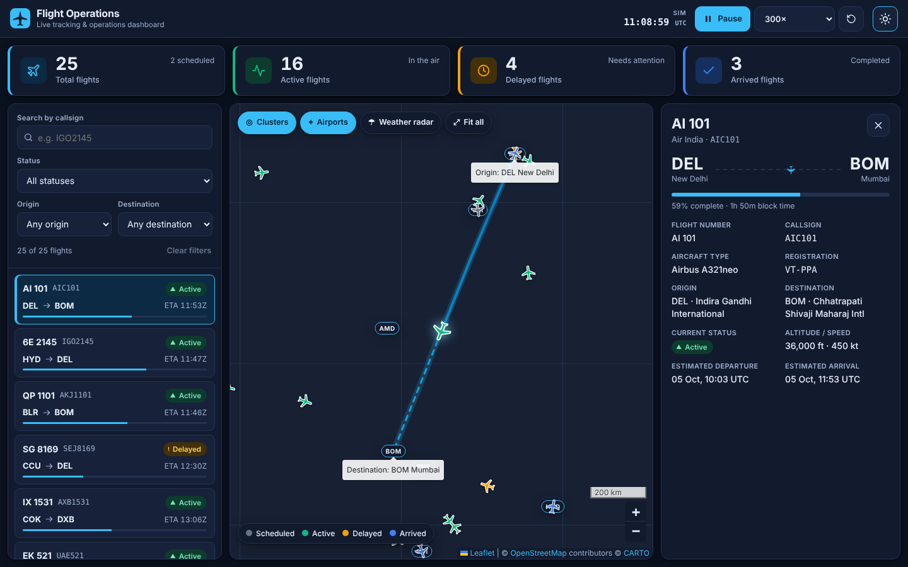
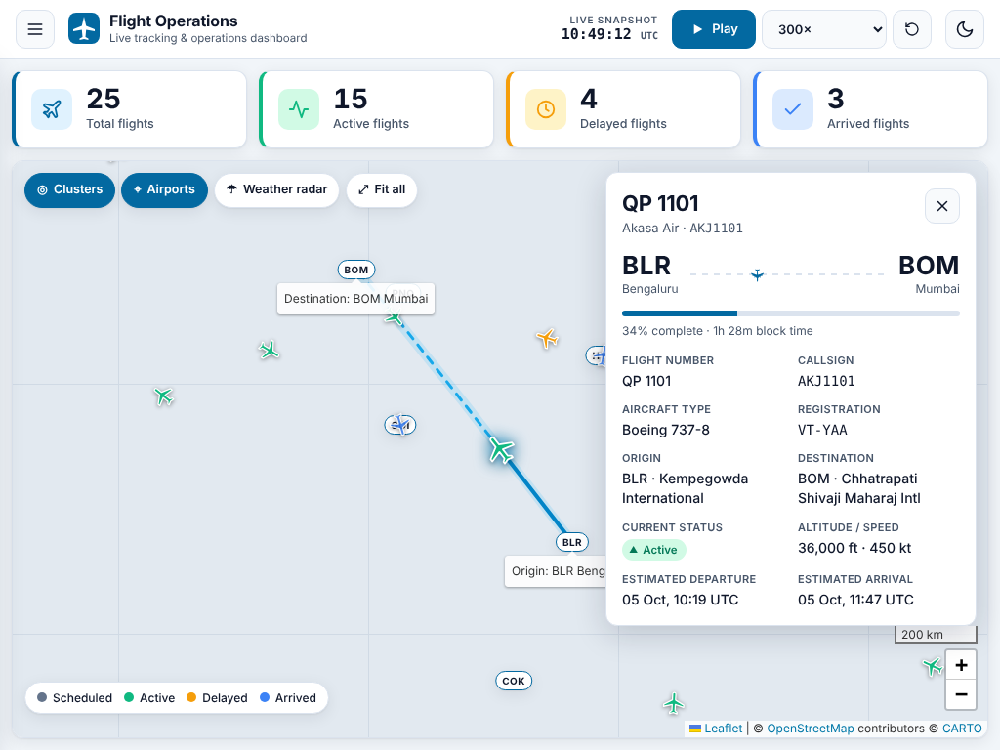

# Flight Tracking & Operations Dashboard

A responsive aviation operations dashboard built with **Angular 18**, **TypeScript**, **RxJS**, **Reactive Forms** and **Leaflet**. Operations staff can monitor 25 mock flights on an interactive map, drill into a flight's route and details, watch KPIs update, and search / filter the fleet.



| Selected flight + route | Dark mode | Tablet |
|---|---|---|
|  |  |  |

> Screenshots were captured in a sandbox with no internet access, so the basemap tiles are replaced by a neutral grid. When you run the app locally the real CARTO / OpenStreetMap tiles load.

---

## Quick start

**Requirements:** Node.js 18.19+ (20 LTS recommended) and npm 9+.

```bash
npm install
npm start          # http://localhost:4200
```

| Command | What it does |
|---|---|
| `npm start` | Dev server with live reload |
| `npm run build` | Production build into `dist/` |
| `npm test` | Unit tests (Karma + Jasmine, headless Chrome) — 18 tests |

If Chrome is installed in a non-standard location set `CHROME_BIN` before `npm test`.

---

## Requirements coverage

| Requirement | Where / how |
|---|---|
| **Leaflet map, 15–20+ flights** | 25 flights from `public/data/flights.json`, 18 airports in `airports.json` — `flight-map.component.ts` |
| **Marker info** (flight no., callsign, origin, destination, status) | Popup on click/Enter, plus a `title`/`alt` for hover and screen readers |
| **Route visualisation** | Selecting a flight draws a great-circle polyline (solid = flown, dashed = remaining, glow halo), marks origin/destination, and `flyTo`s the aircraft |
| **Flight details panel** | Flight no., callsign, aircraft type, origin, destination, status, ETD, ETA (+ registration, altitude, speed, progress, delay) |
| **KPI cards** | Total / Active / Delayed / Arrived — computed reactively from the flight stream |
| **Search & filters** | Callsign search + Status + Origin + Destination, built with **Reactive Forms** (debounced), with "Clear filters" and a live result count |
| **Routing** | `/` and `/flight/:id` (deep-linkable selection). A single route + `UrlMatcher` keeps the map alive between selections |
| **Services / RxJS** | `FlightService` (state, derived streams, simulation clock), `ThemeService` |
| **Responsive** | Desktop 3-column layout → tablet layout with slide-in flights drawer and floating details panel → phone bottom sheet |
| **Accessibility** | Skip link, landmarks, labelled controls, `aria-pressed`/`aria-current`/`aria-live`, keyboard-focusable markers, visible focus rings, status never conveyed by colour alone, reduced-motion support, `Esc` to close |

### Bonus features included
- ✅ **Flight playback / animation** – simulation clock with 1× / 60× / 300× / 900× speeds, pause and restart. Flights take off, fly, and land; statuses and KPIs update live. The map follows the selected aircraft.
- ✅ **Dark mode** – persisted, respects `prefers-color-scheme`, also switches the basemap.
- ✅ **Marker clustering** – `leaflet.markercluster`, toggleable.
- ✅ **Airport markers** – IATA pills with name/city tooltips, toggleable.
- ✅ **Weather overlay** – RainViewer radar tiles, toggleable (needs internet; fails gracefully with a message).
- ✅ **Unit tests** – geo maths, flight-state resolution, service (KPIs, filters, selection), and shared components.

---

## Architecture

```
src/app/
├── core/
│   ├── models/flight.model.ts          # Flight, Airport, FlightFilters, KPIs …
│   ├── services/
│   │   ├── flight.service.ts           # State + derived RxJS streams + simulation clock
│   │   └── theme.service.ts            # Light/dark theme persistence
│   └── utils/
│       ├── geo.util.ts                 # haversine, great-circle interpolation, bearing
│       └── flight-calc.util.ts         # PURE: (flight blueprint, time) → Flight snapshot
├── shared/components/                  # Reusable, presentation-only
│   ├── kpi-card/
│   └── status-badge/
└── features/dashboard/
    ├── dashboard.component.*           # Container: combines streams into one view-model
    └── components/                     # Dumb components (inputs/outputs only)
        ├── dashboard-header/  playback-controls/  flight-filters/
        ├── flight-list/       flight-details/     flight-map/
```

**Key design decisions**

1. **Flights are a pure function of time.** `resolveFlight(blueprint, now)` derives status, progress, position, heading, altitude and speed from a simulation clock. That makes playback trivial (just advance the clock), keeps KPIs/status consistent with what's on the map, and makes the logic easy to unit-test.
2. **Smart/dumb component split.** Only `DashboardComponent` talks to services. Everything else is `OnPush` with `@Input`/`@Output`, so components are reusable and cheap to render.
3. **One reactive pipeline.** `flights$ → filteredFlights$ / kpis$ / selectedFlight$` (all `shareReplay`'d) are combined once into a view-model and consumed with the `async` pipe — no manual subscriptions in components.
4. **Leaflet outside Angular's zone.** Map events and per-tick marker updates don't trigger app-wide change detection; markers are updated in place (`setLatLng`/`setIcon` only when something changed) instead of being rebuilt.
5. **Mock data stays time-relative.** `flights.json` stores departure *offsets* (e.g. "departed 45 min ago"), so the demo always looks live whenever it's opened.

## Mock data

`public/data/flights.json` – 25 flights (IndiGo, Air India, Akasa, SpiceJet, Emirates, Qatar, Singapore Airlines, …) with a realistic mix: **15 active, 4 delayed (airborne and on the ground), 3 arrived, 3 scheduled**. Block times are derived from great-circle distance and cruise speed. Replace the two `HttpClient` calls in `FlightService.load()` with a real API and nothing else needs to change.

## Notes & limitations
- Basemap tiles are CARTO (light/dark) over OpenStreetMap data and radar is RainViewer — both need internet access and are subject to their usage terms; swap the URLs in `flight-map.component.ts` for a commercial provider in production.
- Times are shown in UTC, as is standard in operations.
- No backend; state lives in the browser session.
